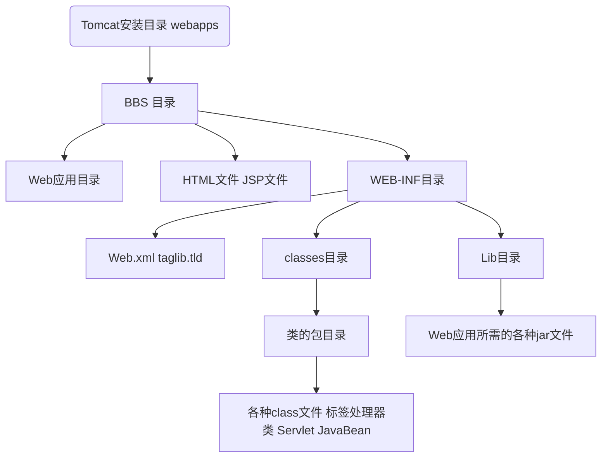

# 回顾

Java基础（面向对象，集合，界面，线程，文件，网络）

JDBC（Java的数据库编程）

Oracle/MySQL/sqlservlet

html css js（Web开发）

xml

----

# Tomcat

+ java ee 体系的介绍
+ servlet 项目演示
+ web 开发介绍
    + 静态页面
    + 动态页面
        + 用户可以输入数据，和页面交互（注册，购物，发帖子，付款…）
        + 不同时间打开页面，内容是变化的
        + 目前比较流行的动态页面技术（servlet/jsp，php，asp.net，cgi）
            + 动态网页的技术比较
            + 为什么需要web服务器/web究竟是干什么的


模拟一个web服务器

```java
	import java.io.*;
	import java.net.*;
	public class MyTomcat {
	
		public static void main(String[] args) 	throws Exception {
			// TODO Auto-generated method stub
			ServerSocket ss=new 			ServerSocket(9999);
			Socket s=ss.accept();
			System.out.println("在8080上等待连接");
			OutputStream os=s.getOutputStream();
			BufferedReader br=new BufferedReader(new FileReader("C:\\Users\\Yankfu\\Documents\\project\\_2019_秋季Web\\pages\\test.html"));
			String buf="";
			while((buf=br.readLine())!=null) {
				os.write(buf.getBytes());
			}
			br.close();
			os.close();
			s.close();
		}
	}
```

----

安装tomcat服务器

1.解压

2.配置

在环境变量中添加JAVA_HOME 指向jdk的主目录


在用户变量或者系统变量建立都可以

3.启动tomcat服务器

到tomcat主目录下启动


4.验证是否安装成功

http://localhost:8080


5.tomcat无法正常启动的原因分析

1.JAVA_HOME 配置错误，或者没有配置

2.不能去抢占端口（已经有程序占用8080端口）

​	1.可以先关闭8080端口

​	netstat -anb查看谁占用了8080

​	然后通过控制台结束进程

​	2.更换端口


​	3.打开后导航到另外一个页面去

​	修改管理加载项，把默认的导航禁用

​	4.保证tomcat一直启动

​	5.JAVA_HOME环境变量的设置问题

​	也可以在startup.bat文件中设置JAVA_HOME的环境变量


一定要在固定位置修改


----

Tomcat目录结构


| 目录    | 用处                                             |
| ------- | ------------------------------------------------ |
| bin     | 存放启动和关闭Tomcat的脚本文件                   |
| conf    | 存放Tomcat服务器的各种配置文件                   |
| lib     | 存放Tomcat服务器的支撑jar包                      |
| logs    | 存放Tomcat的日志文件                             |
| temp    | 存放Tomcat运行时产生的临时文件                   |
| webapps | web应用所在目录，即供外界访问的web资源的存放目录 |
| work    | Tomcat的工作目录                                 |

bin：启动和关闭tomcat的脚本文件

conf：配置文件

server.xml 该文件用于配置server相关的信息，比如tomcat启动端口后配置Host，配置Context 即web应用

web.xml 该文件配置与web应用相关的东西

tomcat-users.xml 该文件用于配置tomcat的用户密码和权限

lib：该目录放置运行tomcat运行需要的jar包

logs：存放日志，当我们需要去查看日志的时候用。

webapps：该目录下，放置我们的web应用

建立web1目录，下面放置我们的html文件、图片…则未必就被当作一个web应用管理起来。


work：工作目录该目录用于存放JSP被访问后生成的对应的servlet文件和class文件



现在我们要求，把hello.html文件设置成web应用的首页，则需要把web应用的目录格式做的更加规范。

+ 在web-inf下的web.xml文件中添加

```	xml
<welcome-file-list>
	<welcome-file>index.html</welcome.file>
</welcome-file-list>
```

web-inf目录下的classes目录将来是存放class文件

lib目录将来存放jar文件

web.xml配置当前这个web应用的信息

## tomcat 如何管理虚拟目录

需求：当我们把web应用放到webapps目录，tomcat会自动管理，如果我们希望tomcat可以管理其他目录下的web应用-->虚拟目录配置

配置虚拟目录在tomcat的conf目录下的server.xml的\<Host\>节点


path就是 http://xxx/web应用名/资源名

docBase虚拟目录在真么路径（绝对路径）

需要重新启动才能有效

context 的几个属性的说明

path

docBase

reloadable 如果设为true，表示tomcat会自动更新web应用，这个开销比较大，建议开发过程中可以设为true，但是发布必须设置为false

upackWAR 发布war包时，如果设为true会自动解压，否则不会自动解压。


如何配置自己的主机名


看看浏览器访问要给web站点的流程


步骤如下：

（1）在这个路径下的 C:\Windows\System32\drivers\etc

host

最后添加

127.0.0.1		www.niubiplus.com

（2）在tomcat的service.xml 文件添加主机名

（3）在路径下加入/WEB-INF/web.xml把hello.html设为首页面

路径的“C:”一定要改成小写！

（4）^*^如果连8080都不想显示就把端口号改成80